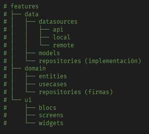
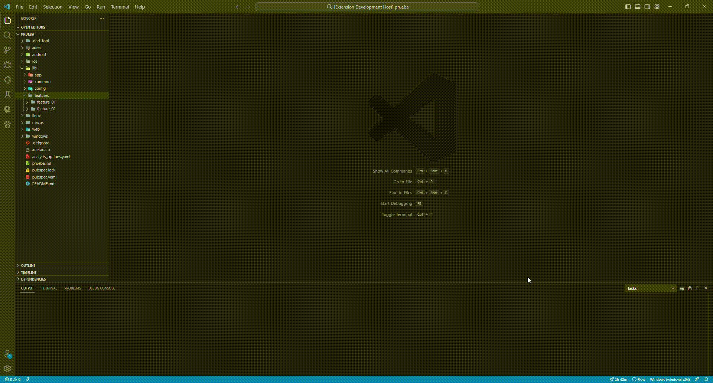
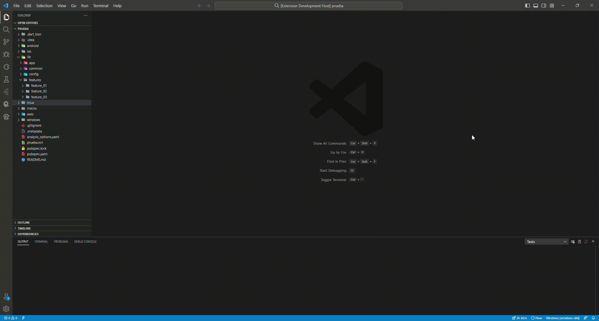
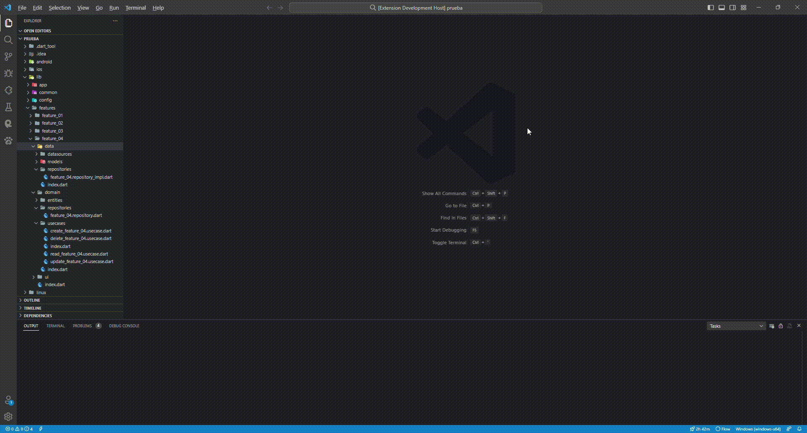

# Flutter Clean Architecture 🏗️
<p align="left">
    <a href="https://opensource.org/licenses/MIT"></a>    
    <a href="https://github.com/chiuchiolo30/vscode-extension-arq-hex/actions/workflows/pipeline.yaml"></a>
    <a href="https://marketplace.visualstudio.com/items?itemName=FlutterCleanArchitecture.dart-clena-architecture-hex"></a>
</p>



Genera automáticamente la estructura completa de **Clean Architecture (Arquitectura Hexagonal)** para tus proyectos Flutter/Dart. ¡Ahorra tiempo y mantén tu código organizado desde el primer día!

✨ **Ahora con soporte completo para Monorepos Melos**


## ✨ Características Principales

### 🔍 Previsualización Antes de Generar (¡NUEVO!)
* **Preview completo**: Ve qué carpetas y archivos se crearán antes de confirmar
* **Resumen detallado**: Estadísticas (cantidad de carpetas/archivos) y contexto (app, modo, feature)
* **Confirmación segura**: Cancela sin crear nada si algo no se ve bien
* **Configurable**: Habilita/deshabilita preview según tu preferencia
* [📖 Ver guía completa del Preview](./PREVIEW_FEATURE_GUIDE.md)

### 🏗️ Dos Modos de Estructura
* **Feature-First** (por defecto): Organiza código por funcionalidad - `lib/features/<feature>/domain|data|ui/`
* **Layer-First**: Organiza código por capas arquitectónicas - `lib/domain|data|ui/<feature>/`
* **Detección automática**: La extensión detecta el modo usado en tu proyecto
* **Configuración flexible**: Cambia de modo por proyecto/app con un solo comando

### 🎯 Generación Automática de Estructura
* **Capas bien definidas**: Data, Domain y Presentation siguiendo Clean Architecture
* **Exports automáticos**: Genera archivos `index.dart` en cada carpeta
* **CRUD completo**: Crea operaciones Create, Read, Update y Delete con un comando
* **Use Cases individuales**: Agrega casos de uso específicos a features existentes
* **Compatible con ambos modos**: Todos los comandos funcionan en Feature-First y Layer-First

### 🚀 Soporte para Monorepos Melos
* **Detección automática**: Identifica proyectos Melos sin configuración
* **Selector inteligente**: Muestra solo las apps de tu monorepo (filtra packages)
* **Multi-proyecto**: Trabaja con múltiples apps desde el mismo workspace
* **Modo independiente**: Cada app puede usar Feature-First o Layer-First

### 💬 Experiencia de Usuario Mejorada
* **Mensajes amigables**: Notificaciones con íconos y detalles claros
* **Guías contextuales**: Ejemplos en cada input para ayudarte
* **Sugerencias útiles**: Tips cuando algo falta o hay un error

## Requerimientos

Antes de utilizar esta extensión, asegúrate de tener instalado [Visual Studio Code](https://code.visualstudio.com/) y la extensión [Dart](https://marketplace.visualstudio.com/items?itemName=Dart-Code.dart-code).

## 📦 Soporte para Monorepos Melos

¿Trabajas con múltiples apps en un mismo repositorio? ¡Esta extensión está diseñada para ti!

### Cómo Funciona

1. **Detección automática**: Al ejecutar cualquier comando, la extensión busca `melos.yaml` en tu proyecto
2. **Selector visual**: Te muestra una lista elegante con todas tus apps Flutter
3. **Filtrado inteligente**: Solo muestra apps (carpeta `apps/`), no packages compartidos
4. **Workflow consistente**: Funciona igual que en proyectos normales, pero con la flexibilidad de elegir la app

### Ejemplo en Melos

```
📦 Monorepo Melos - Selección de App
🎯 Selecciona la app donde crear la feature

📱 main_app         📂 apps/main_app
📱 admin_app        📂 apps/admin_app  
📱 customer_app     📂 apps/customer_app
```

Para más detalles, consulta [MELOS_GUIDE.md](MELOS_GUIDE.md)

## 🚀 Instalación

1. Abre VS Code
2. Ve a Extensions (`Ctrl+Shift+X` o `Cmd+Shift+X`)
3. Busca **"Flutter Clean Architecture"** o **"flutter-arq-hex"**
4. Haz clic en **Install**

## 📖 Uso Rápido

### Comandos Disponibles

Abre la paleta de comandos (`Ctrl+Shift+P` / `Cmd+Shift+P`) y busca:

| Comando | Descripción |
|---------|-------------|
| `Clean Architecture: Create Feature` | Crea una feature básica sin CRUD |
| `Clean Architecture: Create Feature with CRUD` | Crea una feature completa con operaciones CRUD |
| `Clean Architecture: Create Use Case` | Agrega un caso de uso a una feature existente |
| `Clean Architecture: Set project structure mode` | Configura el modo Feature-First o Layer-First |
| `Clean Architecture: Toggle preview before generation` | Habilita o deshabilita la previsualización antes de generar |

### Paso a Paso

1. **Abre tu proyecto Flutter** (normal o monorepo Melos)
2. **Ejecuta un comando** desde la paleta
3. **Selecciona la app** (si es monorepo) o confirma el proyecto actual
4. **Ingresa el nombre** de la feature o use case
5. **¡Listo!** La estructura se genera automáticamente

## 🏗️ Modos de Estructura: Feature-First vs Layer-First

Esta extensión soporta dos estilos de organización de código Clean Architecture:

### 📦 Feature-First (Modo por defecto)

**Organiza el código por funcionalidad**. Cada feature contiene sus propias capas.

```
lib/
  features/
    authentication/
      domain/
        entities/
        repositories/
        usecases/
      data/
        datasources/
        models/
        repositories/
      ui/
        screens/
        widgets/
        blocs/
    products/
      domain/
      data/
      ui/
```

**✅ Ventajas:**
- Ideal para proyectos pequeños y medianos
- Fácil de navegar: todo lo relacionado está junto
- Borrar una feature es simple (eliminar una carpeta)
- Reutilización de código dentro de la feature

**📝 Cuándo usar:** Proyectos con features relativamente independientes

---

### 🏗️ Layer-First

**Organiza el código por capas arquitectónicas**. Cada capa contiene todas las features.

```
lib/
  domain/
    authentication/
      entities/
      repositories/
      usecases/
    products/
      entities/
      repositories/
      usecases/
  data/
    authentication/
      datasources/
      models/
      repositories/
    products/
      datasources/
      models/
      repositories/
  ui/
    authentication/
      screens/
      widgets/
      blocs/
    products/
      screens/
      widgets/
      blocs/
```

**✅ Ventajas:**
- Ideal para proyectos grandes y complejos
- Separación clara de responsabilidades por capa
- Facilita la reutilización entre features de la misma capa
- Mejor para equipos especializados por capa

**📝 Cuándo usar:** Proyectos empresariales con múltiples features interconectadas

---

### ⚙️ Cómo Funciona la Detección Automática

Por defecto, la extensión detecta automáticamente el modo usado en tu proyecto:

1. **Detecta Feature-First** si existe `lib/features/`
2. **Detecta Layer-First** si existe `lib/domain/`, `lib/data/` o `lib/ui/`
3. **Usa Feature-First por defecto** si es un proyecto nuevo (solo `lib/`)
4. **Pregunta al usuario** si detecta ambos estilos (ambiguo)

### 🔧 Configurar el Modo Manualmente

Puedes forzar el modo para un proyecto/app específico:

1. Abre la paleta de comandos (`Ctrl+Shift+P` / `Cmd+Shift+P`)
2. Busca: `Dart Clean Architecture: Set project structure mode`
3. Selecciona tu opción:
   - **Feature-First**: Organizar por funcionalidad
   - **Layer-First**: Organizar por capas
   - **Auto**: Detectar automáticamente (limpia configuración manual)

**💡 En monorepos Melos**: La configuración se guarda por app, así cada una puede usar su propio modo.

### ⚙️ Configuración Avanzada (settings.json)

```json
{
  // Modo por defecto (si no se puede detectar)
  "dartCleanArch.structure.mode": "featureFirst",  // "featureFirst" | "layerFirst"
  
  // Habilitar detección automática
  "dartCleanArch.structure.autoDetect": true,
  
  // Preguntar cuando se detectan ambos estilos
  "dartCleanArch.structure.promptOnAmbiguous": true
}
```

**Prioridad de decisión:**
1. Configuración manual (comando "Set project structure mode")
2. Detección automática (si `autoDetect` = true)
3. Valor por defecto en settings (`mode`)

---
## Crear una nueva carateristica sin el CRUD


## Crear una nueva carateristica con el CRUD


## Crear un caso de uso dentro de una feature


¡Listo! La estructura de carpetas y archivos para la arquitectura limpia ha sido generada. Puedes empezar a implementar tus clases y métodos.

# Licencia
Esta extensión está bajo la licencia [MIT](https://opensource.org/licenses/MIT).

**Enjoy!**
